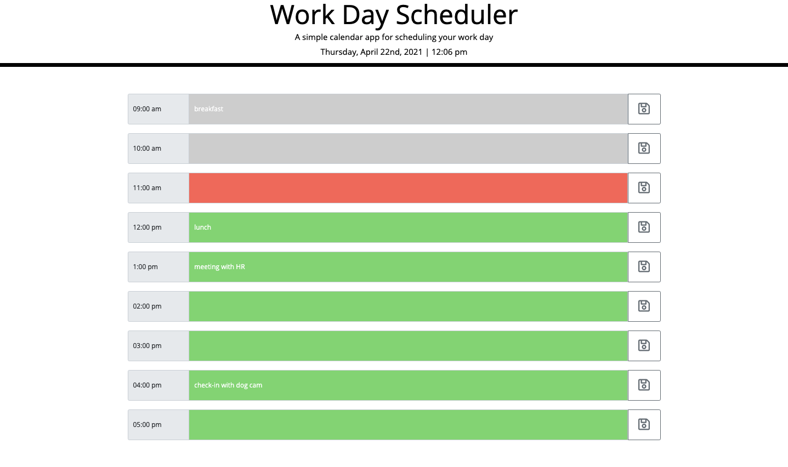

# Work Day Scheduler

## Description
- A simple calendar application that allows a user to save events for each hour of the day

### The User Story for this project is as follows:
- AS AN employee with a busy schedule, I WANT to add important events to a daily planner SO THAT I can manage my time effectively

### The codebase meets the following criteria for acceptance:
- WHEN I open the planner, THEN the current day is displayed at the top of the calendar
- WHEN I scroll down, THEN I am presented with timeblocks for standard business hours
- WHEN I view the timeblocks for that day, THEN each timeblock is color coded to indicate whether it is in the past, present, or future
- WHEN I click into a timeblock, THEN I can enter an event
- WHEN I click the save button for that timeblock, THEN the text for that event is saved in local storage
- WHEN I refresh the page, THEN the saved events persist

### Installation
- The project is uploaded to [GitHub](https://github.com/) at the following repository: [here](https://github.com/sourslaw/05_Work_Day_Scheduler)
<!-- - Deployed application may be seen: [here]() -->

### Usage
. . .

### Credits
- [jQuery](https://jquery.com/)
- [Moment.js](https://momentjs.com/)

### License
- Licensed under the [MIT](https://opensource.org/licenses/mit-license.php) license.